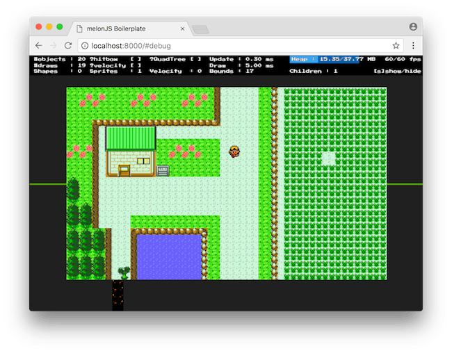

# melonjs-town-sample

[](https://github.com/prettier/prettier)

## Description



* sample project using [melonjs/boilerplate](https://github.com/melonjs/boilerplate)
* assets from [capsulemonsters/newbark](https://github.com/capsulemonsters/newbark)

## Usage

```
# install grunt if you don't have
npm install -g grunt-cli

# npm install
npm install

# displayed by Web browser (localhost:8000)
grunt serve
```
